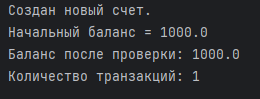
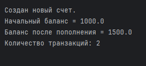
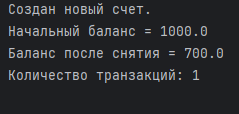
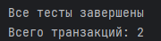
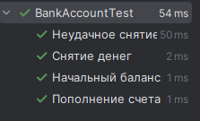
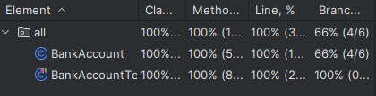

# Лабораторная работа №2_1: Тестовое окружение в JUnit

## 👨‍🎓 Студент
- **ФИО:** Баранов Артём Александрович
- **Группа:** 245
- **Вариант:** 5 (Банковский счет)

---

## ✅ Выполненные задания

### Задание 1 (Простое)
**Тест:** Используйте @BeforeEach для создания счета "Петров" с балансом 1000. Проверьте, что начальный баланс равен 1000.

### Задание 2 (Среднее)
**Тесты:**
- Пополнение на 500 (баланс должен стать 1500).
- Снятие 300 (успешное снятие, баланс 700).
  
  

### Задание 3 (Сложное)
**Тест:** Проверка статического счетчика операций

---

## 📊 Результаты

---

## 📎 Ссылки
- [Код тестов](/task/src/BankAccount.java)
- [Основной класс](/task/src/BankAccountTest.java)

*Дата: 11.03.2026*